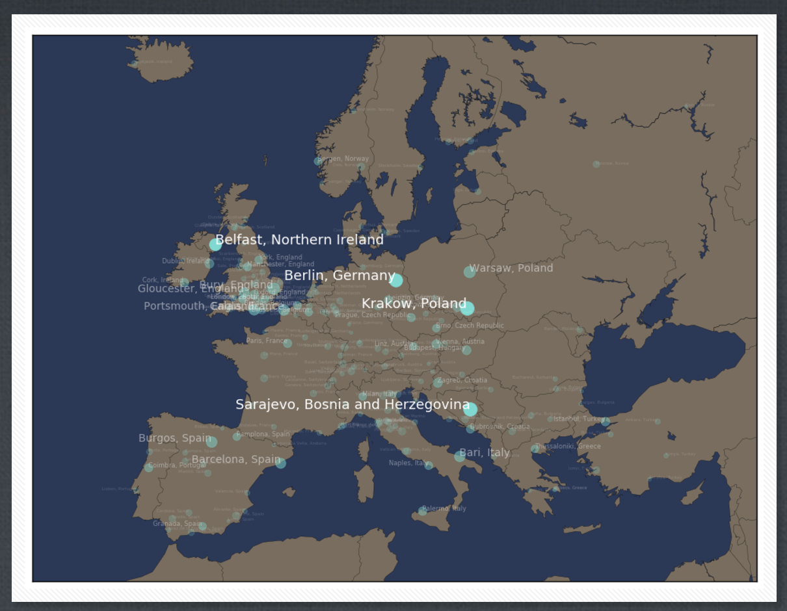
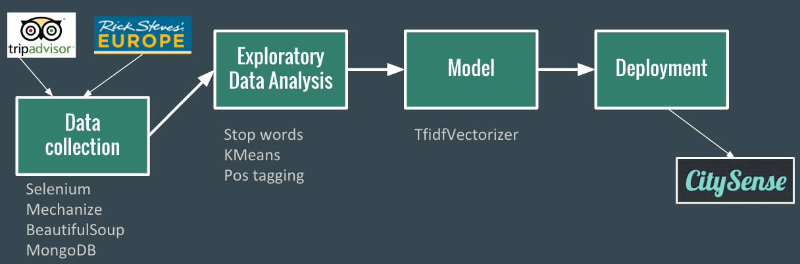
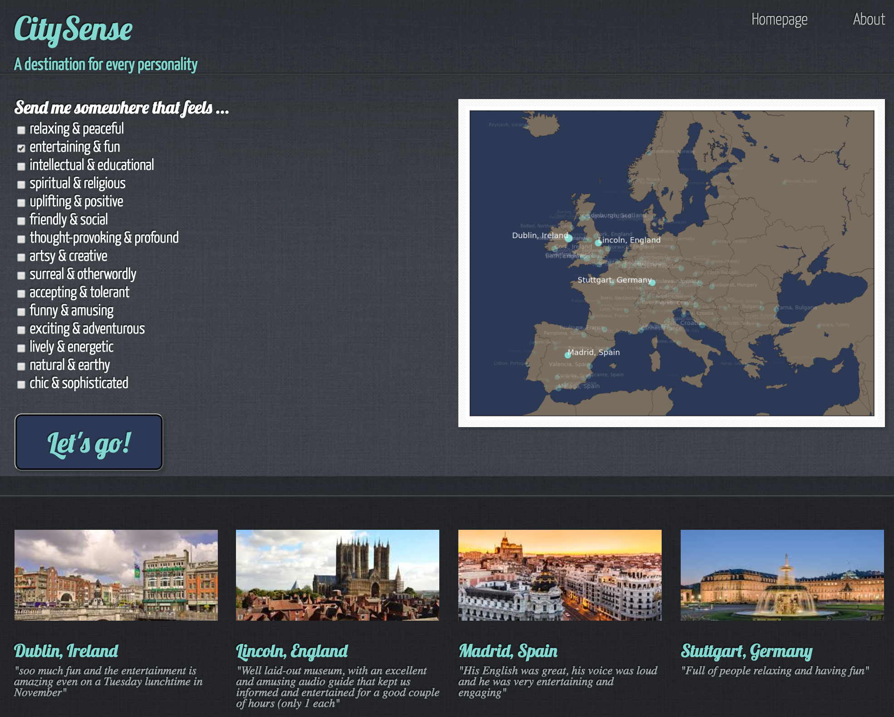

## City Sense
Using NLP to identify the personalities of European cities

### Business Understanding
Before a trip, travelers can find all sorts of information about what to do and where to stay at their destination, but it can be difficult to get a sense of a city’s ambience or feeling. This project uses natural language processing in python to identify the personalities of European cities and provide insight to potential visitors.

### Data Understanding
First person anecdotes about European cities can be found on ricksteves.com and tripadvisor.com. I scraped the two sites for major cities in Europe using Selenium, Mechanize, and BeautifulSoup and combined the text from all of the articles and reviews for a given city.

### Data Preparation
The text data were cleaned of punctuation and non-ascii characters in order to process as a corpus using nltk. Exploratory data analysis was done to view the top features for different cities by term frequency and term frequency - inverse document frequency, over the complete documents and subsets of the documents separated by part of speech. The text were grouped by parts of speech and stop words criteria were generated for each part of speech in order to maintain the most useful text.

### Data Pipeline:
1. Scrape data from ricksteves.com and tripadvisor.com store in mongodb and dump to json
Read json files into dictionary where city names are the keys and text from reviews/articles are the values
2. Make a tokenized version of the corpus using word tokenize from nltk.tokenize and remove nltk english stop words as well as custom stop words.
3. Vectorize using nltk TfidfVectorizer and compute cosine similarities between predetermined sets of personality words.
4. Make it live! Create web app in which user can select the character traits that they want a city to have and see the results.

### Modeling
The results of the exploratory data analysis were used to determine the stop words and get ideas for the types of personalities that a city can have. sklearn TfidfVectorizer was used to vectorize the documents with stop words removed as well as the personalities. Cosine similarity was used to find the city that best matches each personality.

### Evaluation
Since this is an unsupervised learning model on text data, there is not a mathematical way to assess the validity of the model. I evaluated my model by creating a survey of the subset of the cities represented in my corpus, and collected results from people who have experienced those cities.

### Deployment

The model is deployed as a flask web app at <a href="http://sydney.center/">sydney.center</a>, where users can select personality trait(s) and find the cities that are the best fit.

